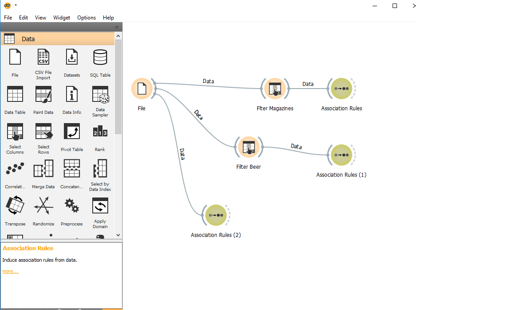
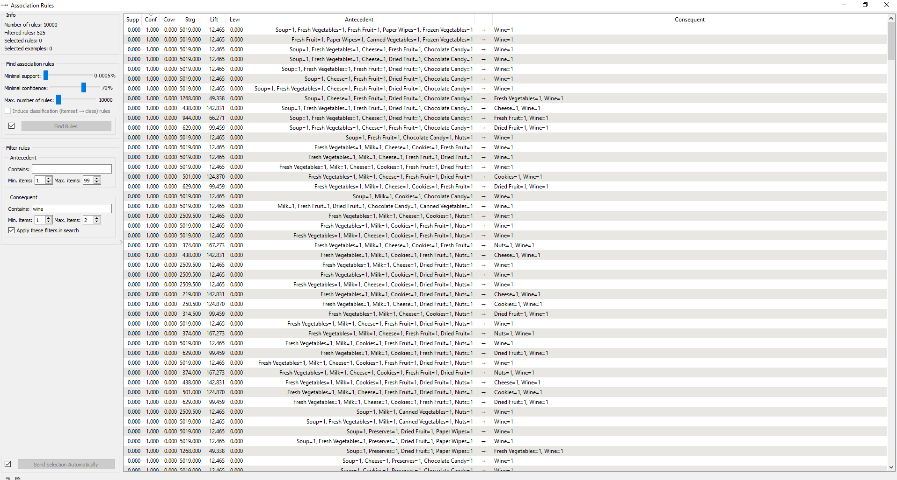
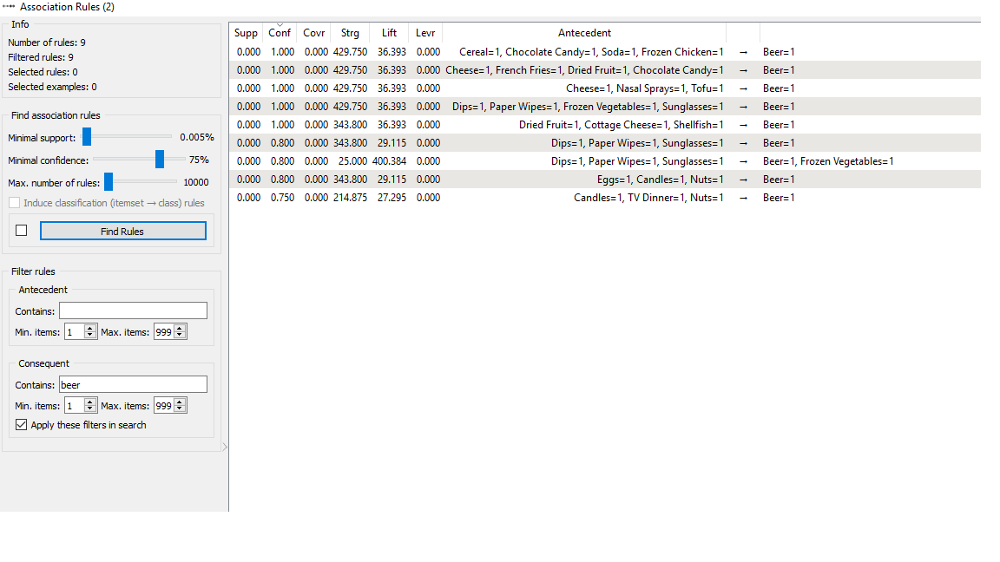
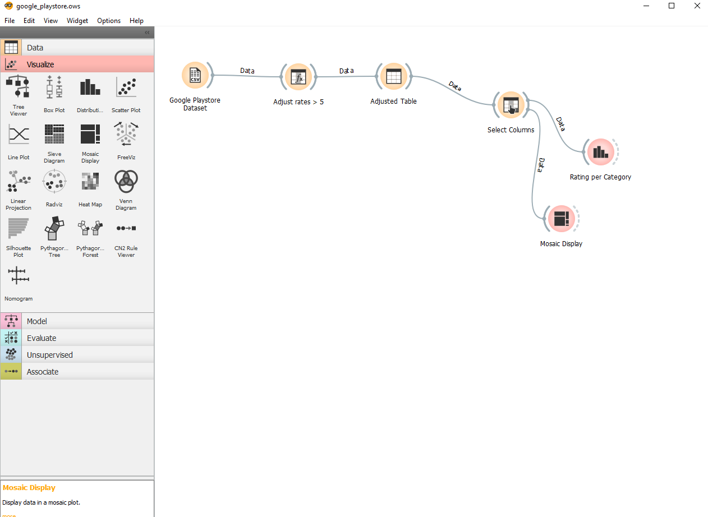
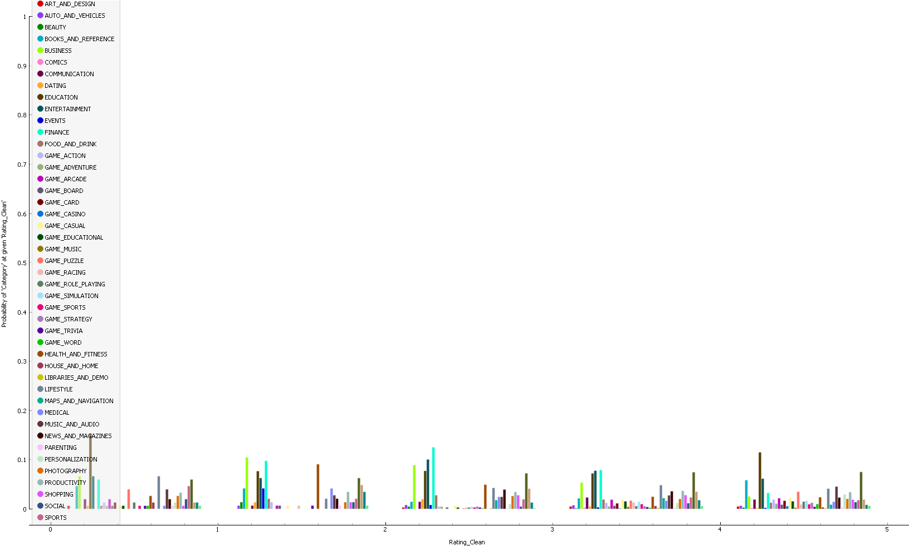
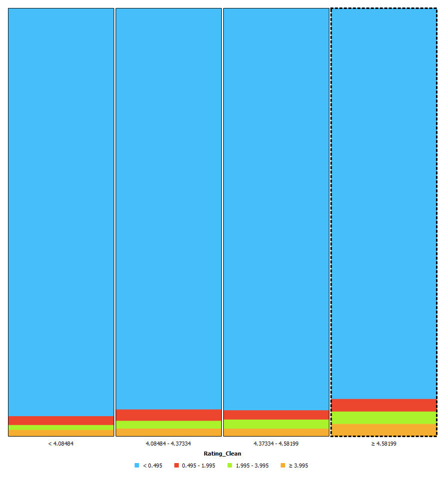
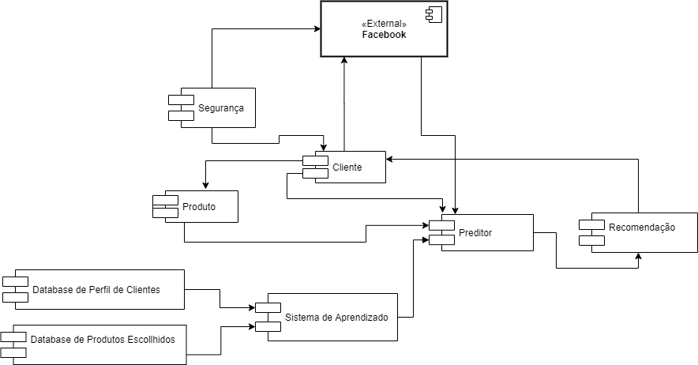
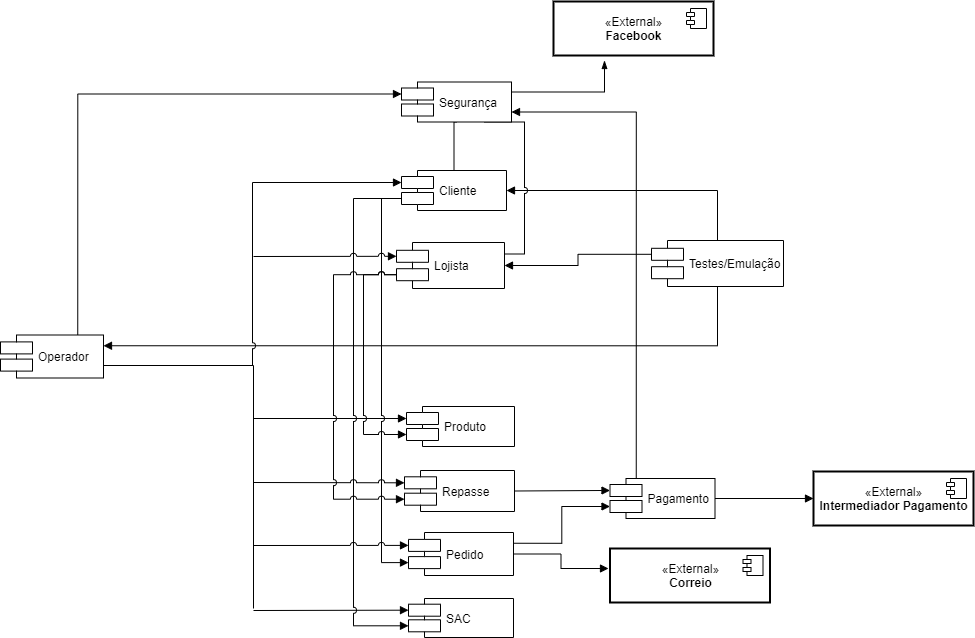
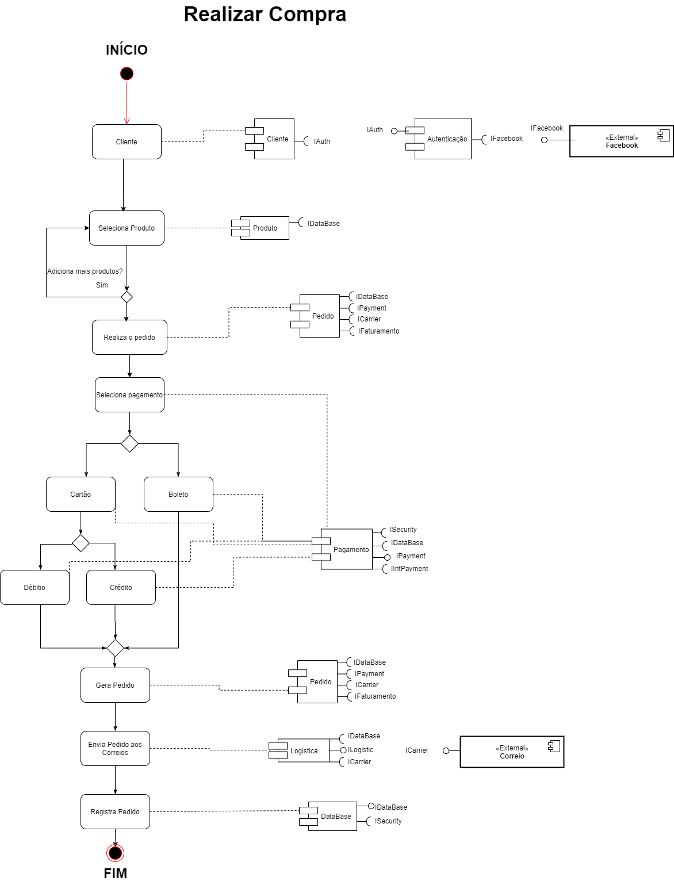
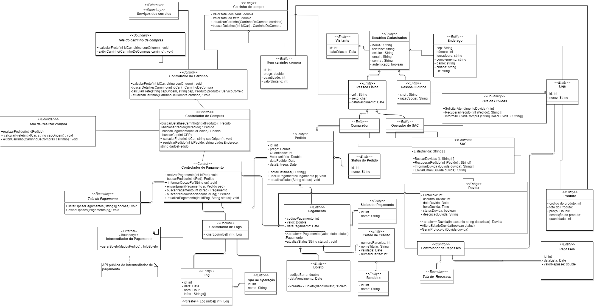

# Lab 1
Tarefas do laboratório 1 - Renato César Alves de Oliveira

# Projeto Orange / Regras de Associação para Foodmart

## Imagens do Projeto

### Projeto Orange - Food Mart

### Regra Associação Vinho - Food Mart

### Regra Associação Cerveja - Food Mart

## Arquivo do Projeto
[Arquivo Orange - Foodmart](https://github.com/renato2808/inf331/blob/master/lab1/orange/food_mart.ows)

## Análise

Como pode ser observado nas imagens Regra Associação Vinho e Regra Associação Cerveja, procurei encontrar regras que relacionacem a compra de Vinho e Cerveja por consumidores a outros produtos, de modo que o mercado possa posicionar os produtos de acordo com o comportamento de compra do cliente. É possível notar que a compra de vinho está fortemente ligada a compra de queijos, frutas frescas e sopas, enquanto a compra de Cerveja está fortemente ligada a compra de chocolate e queijo. Desse modo, esses dados podem guiar supermercados ou mercados no posicionamento desses produtos próximos uns aos outros, a fim de induzir uma maior venda dos mesmos.

# Projeto Orange / Análise de Dados do Google PlayStore

## Imagens do Projeto

### Projeto Orange - Google Playstore

## Arquivo do Projeto
[Arquivo Orange - Google Playstore](https://github.com/renato2808/inf331/blob/master/lab1/orange/google_playstore.ows)

## Gráfico(s) de Análise

### Gráfico Probabilidade de Rating por Categoria

### Grafico/Mosaico Preço por Rating

## Análise

O primeiro gráfico mostra qual é a probabilidade de um aplicativo de determinada categoria ter um certo rating. Como é possível observar, os aplicativos de finanças tem alta probabilidade de ter ratings baixos (3 ou menos), já os aplicativos de comunicação tem grande probabilidade de terem ratings altos (maiores que 4). O segundo gráfico, ou mosaico, mostra como os preços dos aplicativos afetam o rating, ou seja, como fato de um aplicativo ser pago ou não afeta nas avaliações que ele recebe. Como é possivel observar, quanto maior o rating, maior o número de aplicativos pagos (faixas laranja, verde e vermelha no mosaico).

## Projeto de Composição de Componentes para Recomendação

## Projeto de Composição de Componentes para Pedido

### Diagrama de Componentes

### Diagrama de Componentes

### Diagrama de Interfaces

