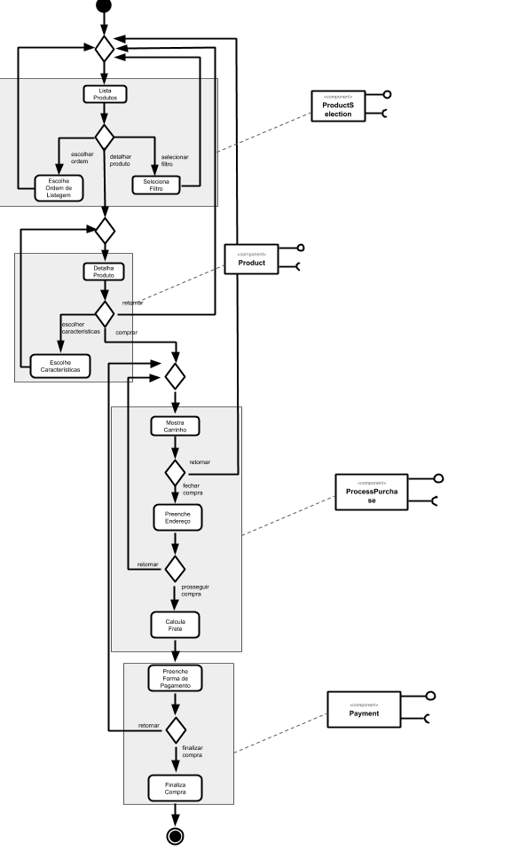
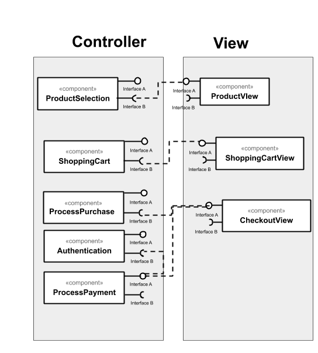
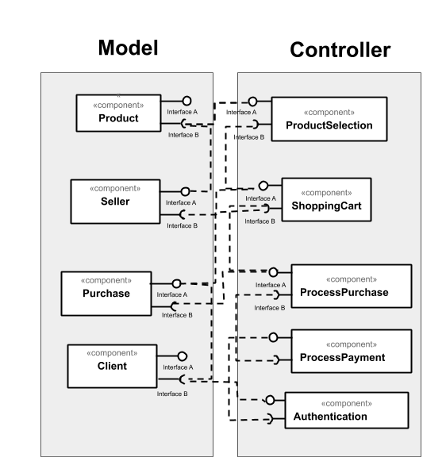

# Lab 4
Tarefas do laboratório 4 - Renato César Alves de Oliveira

## Tarefa 1

## Tarefa 2

## Tarefa 3

## Tarefa 4

### Serviço 1

* **Título do serviço**: Spotify
* **Breve descrição**: Serviço que recebe o codigo de um artista/banda e retorna as músicas mais populares desse artista em determinado país. Na busca abaixo, as 10 músicas mais populares da banda Queen no Brasil são retornadas.
* **URL completa da requisição**: https://api.spotify.com/v1/artists/1dfeR4HaWDbWqFHLkxsg1d/top-tracks?country=BR
* **Cabeçalho HTTP da chamada**:
~~~http
Request URL: https://any-api.com:8443/https://api.spotify.com/v1/artists/1dfeR4HaWDbWqFHLkxsg1d/top-tracks?country=BR
Request Method: GET
Status Code: 200  (from disk cache)
Remote Address: 104.18.60.206:8443
Referrer Policy: no-referrer-when-downgrade
~~~
* **Cabeçalho HTTP da resposta**:
~~~http
access-control-allow-credentials: true
access-control-allow-headers: Accept, App-Platform, Authorization, Content-Type, Origin, Retry-After, Spotify-App-Version, X-Cloud-Trace-Context
access-control-allow-methods: GET, POST, OPTIONS, PUT, DELETE, PATCH
access-control-allow-origin: *
access-control-expose-headers: content-type,cache-control,x-robots-tag,access-control-allow-origin,access-control-allow-headers,access-control-allow-methods,access-control-allow-credentials,access-control-max-age,content-encoding,strict-transport-security,x-content-type-options,date,server,via,alt-svc,connection,transfer-encoding,x-final-url
access-control-max-age: 604800
cache-control: public, max-age=73103
cf-cache-status: DYNAMIC
cf-ray: 5c77437f5c4ff67b-GRU
cf-request-id: 04be6883950000f67bf4a47200000001
content-encoding: br
content-type: application/json; charset=utf-8
date: Sun, 23 Aug 2020 19:33:09 GMT
expect-ct: max-age=604800, report-uri="https://report-uri.cloudflare.com/cdn-cgi/beacon/expect-ct"
server: cloudflare
status: 200
via: HTTP/2 edgeproxy, 1.1 google
x-content-type-options: nosniff
x-final-url: https://api.spotify.com/v1/artists/1dfeR4HaWDbWqFHLkxsg1d/top-tracks?country=BR
x-request-url: https://api.spotify.com/v1/artists/1dfeR4HaWDbWqFHLkxsg1d/top-tracks?country=BR
x-robots-tag: noindex, nofollow
~~~
* **Conteúdo da resposta**:
~~~json
{
  "tracks" : [ {
    "album" : {
      "album_type" : "album",
      "artists" : [ {
        "external_urls" : {
          "spotify" : "https://open.spotify.com/artist/1dfeR4HaWDbWqFHLkxsg1d"
        },
        "href" : "https://api.spotify.com/v1/artists/1dfeR4HaWDbWqFHLkxsg1d",
        "id" : "1dfeR4HaWDbWqFHLkxsg1d",
        "name" : "Queen",
        "type" : "artist",
        "uri" : "spotify:artist:1dfeR4HaWDbWqFHLkxsg1d"
      } ],
      "external_urls" : {
        "spotify" : "https://open.spotify.com/album/1GbtB4zTqAsyfZEsm1RZfx"
      },
      "href" : "https://api.spotify.com/v1/albums/1GbtB4zTqAsyfZEsm1RZfx",
      "id" : "1GbtB4zTqAsyfZEsm1RZfx",
      "images" : [ {
        "height" : 640,
        "url" : "https://i.scdn.co/image/ab67616d0000b273e319baafd16e84f0408af2a0",
        "width" : 640
      }, {
        "height" : 300,
        "url" : "https://i.scdn.co/image/ab67616d00001e02e319baafd16e84f0408af2a0",
        "width" : 300
      }, {
        "height" : 64,
        "url" : "https://i.scdn.co/image/ab67616d00004851e319baafd16e84f0408af2a0",
        "width" : 64
      } ],
      "name" : "A Night At The Opera (2011 Remaster)",
      "release_date" : "1975-11-21",
      "release_date_precision" : "day",
      "total_tracks" : 12,
      "type" : "album",
      "uri" : "spotify:album:1GbtB4zTqAsyfZEsm1RZfx"
    },
    "artists" : [ {
      "external_urls" : {
        "spotify" : "https://open.spotify.com/artist/1dfeR4HaWDbWqFHLkxsg1d"
      },
      "href" : "https://api.spotify.com/v1/artists/1dfeR4HaWDbWqFHLkxsg1d",
      "id" : "1dfeR4HaWDbWqFHLkxsg1d",
      "name" : "Queen",
      "type" : "artist",
      "uri" : "spotify:artist:1dfeR4HaWDbWqFHLkxsg1d"
    } ],
    "disc_number" : 1,
    "duration_ms" : 354320,
    "explicit" : false,
    "external_ids" : {
      "isrc" : "GBUM71029604"
    },
    "external_urls" : {
      "spotify" : "https://open.spotify.com/track/4u7EnebtmKWzUH433cf5Qv"
    },
    "href" : "https://api.spotify.com/v1/tracks/4u7EnebtmKWzUH433cf5Qv",
    "id" : "4u7EnebtmKWzUH433cf5Qv",
    "is_local" : false,
    "is_playable" : true,
    "name" : "Bohemian Rhapsody - 2011 Mix",
    "popularity" : 83,
    "preview_url" : "https://p.scdn.co/mp3-preview/d1ff0ba5c5538ca2c50b808aab2278253c98b038?cid=7c7de202e4df4600b614ed6890bf4cba",
    "track_number" : 11,
    "type" : "track",
    "uri" : "spotify:track:4u7EnebtmKWzUH433cf5Qv"
  }, {
    "album" : {
      "album_type" : "album",
      "artists" : [ {
        "external_urls" : {
          "spotify" : "https://open.spotify.com/artist/1dfeR4HaWDbWqFHLkxsg1d"
        },
        "href" : "https://api.spotify.com/v1/artists/1dfeR4HaWDbWqFHLkxsg1d",
        "id" : "1dfeR4HaWDbWqFHLkxsg1d",
        "name" : "Queen",
        "type" : "artist",
        "uri" : "spotify:artist:1dfeR4HaWDbWqFHLkxsg1d"
      } ],
      "external_urls" : {
        "spotify" : "https://open.spotify.com/album/2yuTRGIackbcReLUXOYBqU"
      },
      "href" : "https://api.spotify.com/v1/albums/2yuTRGIackbcReLUXOYBqU",
      "id" : "2yuTRGIackbcReLUXOYBqU",
      "images" : [ {
        "height" : 640,
        "url" : "https://i.scdn.co/image/ab67616d0000b2737c39dd133836c2c1c87e34d6",
        "width" : 640
      }, {
        "height" : 300,
        "url" : "https://i.scdn.co/image/ab67616d00001e027c39dd133836c2c1c87e34d6",
        "width" : 300
      }, {
        "height" : 64,
        "url" : "https://i.scdn.co/image/ab67616d000048517c39dd133836c2c1c87e34d6",
        "width" : 64
      } ],
      "name" : "Jazz (2011 Remaster)",
      "release_date" : "1978-11-10",
      "release_date_precision" : "day",
      "total_tracks" : 13,
      "type" : "album",
      "uri" : "spotify:album:2yuTRGIackbcReLUXOYBqU"
    },
    "artists" : [ {
      "external_urls" : {
        "spotify" : "https://open.spotify.com/artist/1dfeR4HaWDbWqFHLkxsg1d"
      },
      "href" : "https://api.spotify.com/v1/artists/1dfeR4HaWDbWqFHLkxsg1d",
      "id" : "1dfeR4HaWDbWqFHLkxsg1d",
      "name" : "Queen",
      "type" : "artist",
      "uri" : "spotify:artist:1dfeR4HaWDbWqFHLkxsg1d"
    } ],
    "disc_number" : 1,
    "duration_ms" : 209413,
    "explicit" : false,
    "external_ids" : {
      "isrc" : "GBUM71029610"
    },
    "external_urls" : {
      "spotify" : "https://open.spotify.com/track/5T8EDUDqKcs6OSOwEsfqG7"
    },
    "href" : "https://api.spotify.com/v1/tracks/5T8EDUDqKcs6OSOwEsfqG7",
    "id" : "5T8EDUDqKcs6OSOwEsfqG7",
    "is_local" : false,
    "is_playable" : true,
    "name" : "Don't Stop Me Now - 2011 Mix",
    "popularity" : 83,
    "preview_url" : "https://p.scdn.co/mp3-preview/5fda76b980c7de5df1e7e9b2d54464665b6029ce?cid=7c7de202e4df4600b614ed6890bf4cba",
    "track_number" : 12,
    "type" : "track",
    "uri" : "spotify:track:5T8EDUDqKcs6OSOwEsfqG7"
  }, {
    "album" : {
      "album_type" : "album",
      "artists" : [ {
        "external_urls" : {
          "spotify" : "https://open.spotify.com/artist/1dfeR4HaWDbWqFHLkxsg1d"
        },
        "href" : "https://api.spotify.com/v1/artists/1dfeR4HaWDbWqFHLkxsg1d",
        "id" : "1dfeR4HaWDbWqFHLkxsg1d",
        "name" : "Queen",
        "type" : "artist",
        "uri" : "spotify:artist:1dfeR4HaWDbWqFHLkxsg1d"
      } ],
      "external_urls" : {
        "spotify" : "https://open.spotify.com/album/58alCatewkjNm9IM1Ucj67"
      },
      "href" : "https://api.spotify.com/v1/albums/58alCatewkjNm9IM1Ucj67",
      "id" : "58alCatewkjNm9IM1Ucj67",
      "images" : [ {
        "height" : 640,
        "url" : "https://i.scdn.co/image/ab67616d0000b273056e90910cbaf5c5b892aeba",
        "width" : 640
      }, {
        "height" : 300,
        "url" : "https://i.scdn.co/image/ab67616d00001e02056e90910cbaf5c5b892aeba",
        "width" : 300
      }, {
        "height" : 64,
        "url" : "https://i.scdn.co/image/ab67616d00004851056e90910cbaf5c5b892aeba",
        "width" : 64
      } ],
      "name" : "The Game (2011 Remaster)",
      "release_date" : "1980-06-27",
      "release_date_precision" : "day",
      "total_tracks" : 10,
      "type" : "album",
      "uri" : "spotify:album:58alCatewkjNm9IM1Ucj67"
    },
    "artists" : [ {
      "external_urls" : {
        "spotify" : "https://open.spotify.com/artist/1dfeR4HaWDbWqFHLkxsg1d"
      },
      "href" : "https://api.spotify.com/v1/artists/1dfeR4HaWDbWqFHLkxsg1d",
      "id" : "1dfeR4HaWDbWqFHLkxsg1d",
      "name" : "Queen",
      "type" : "artist",
      "uri" : "spotify:artist:1dfeR4HaWDbWqFHLkxsg1d"
    } ],
    "disc_number" : 1,
    "duration_ms" : 214653,
    "explicit" : false,
    "external_ids" : {
      "isrc" : "GBUM71029605"
    },
    "external_urls" : {
      "spotify" : "https://open.spotify.com/track/5vdp5UmvTsnMEMESIF2Ym7"
    },
    "href" : "https://api.spotify.com/v1/tracks/5vdp5UmvTsnMEMESIF2Ym7",
    "id" : "5vdp5UmvTsnMEMESIF2Ym7",
    "is_local" : false,
    "is_playable" : true,
    "name" : "Another One Bites The Dust - Remastered 2011",
    "popularity" : 82,
    "preview_url" : "https://p.scdn.co/mp3-preview/c105fe344eed632ebb72a1a0ed8efcfb5a47c6ff?cid=7c7de202e4df4600b614ed6890bf4cba",
    "track_number" : 3,
    "type" : "track",
    "uri" : "spotify:track:5vdp5UmvTsnMEMESIF2Ym7"
  }, {
    "album" : {
      "album_type" : "album",
      "artists" : [ {
        "external_urls" : {
          "spotify" : "https://open.spotify.com/artist/1dfeR4HaWDbWqFHLkxsg1d"
        },
        "href" : "https://api.spotify.com/v1/artists/1dfeR4HaWDbWqFHLkxsg1d",
        "id" : "1dfeR4HaWDbWqFHLkxsg1d",
        "name" : "Queen",
        "type" : "artist",
        "uri" : "spotify:artist:1dfeR4HaWDbWqFHLkxsg1d"
      } ],
      "external_urls" : {
        "spotify" : "https://open.spotify.com/album/6reTSIf5MoBco62rk8T7Q1"
      },
      "href" : "https://api.spotify.com/v1/albums/6reTSIf5MoBco62rk8T7Q1",
      "id" : "6reTSIf5MoBco62rk8T7Q1",
      "images" : [ {
        "height" : 640,
        "url" : "https://i.scdn.co/image/ab67616d0000b273d254ca497999ae980a5a38c5",
        "width" : 640
      }, {
        "height" : 300,
        "url" : "https://i.scdn.co/image/ab67616d00001e02d254ca497999ae980a5a38c5",
        "width" : 300
      }, {
        "height" : 64,
        "url" : "https://i.scdn.co/image/ab67616d00004851d254ca497999ae980a5a38c5",
        "width" : 64
      } ],
      "name" : "Hot Space (2011 Remaster)",
      "release_date" : "1982-05-03",
      "release_date_precision" : "day",
      "total_tracks" : 11,
      "type" : "album",
      "uri" : "spotify:album:6reTSIf5MoBco62rk8T7Q1"
    },
    "artists" : [ {
      "external_urls" : {
        "spotify" : "https://open.spotify.com/artist/1dfeR4HaWDbWqFHLkxsg1d"
      },
      "href" : "https://api.spotify.com/v1/artists/1dfeR4HaWDbWqFHLkxsg1d",
      "id" : "1dfeR4HaWDbWqFHLkxsg1d",
      "name" : "Queen",
      "type" : "artist",
      "uri" : "spotify:artist:1dfeR4HaWDbWqFHLkxsg1d"
    }, {
      "external_urls" : {
        "spotify" : "https://open.spotify.com/artist/0oSGxfWSnnOXhD2fKuz2Gy"
      },
      "href" : "https://api.spotify.com/v1/artists/0oSGxfWSnnOXhD2fKuz2Gy",
      "id" : "0oSGxfWSnnOXhD2fKuz2Gy",
      "name" : "David Bowie",
      "type" : "artist",
      "uri" : "spotify:artist:0oSGxfWSnnOXhD2fKuz2Gy"
    } ],
    "disc_number" : 1,
    "duration_ms" : 248440,
    "explicit" : false,
    "external_ids" : {
      "isrc" : "GBUM71029622"
    },
    "external_urls" : {
      "spotify" : "https://open.spotify.com/track/2fuCquhmrzHpu5xcA1ci9x"
    },
    "href" : "https://api.spotify.com/v1/tracks/2fuCquhmrzHpu5xcA1ci9x",
    "id" : "2fuCquhmrzHpu5xcA1ci9x",
    "is_local" : false,
    "is_playable" : true,
    "name" : "Under Pressure - Remastered",
    "popularity" : 80,
    "preview_url" : "https://p.scdn.co/mp3-preview/b329081abca56123f894650065adb85b29b372af?cid=7c7de202e4df4600b614ed6890bf4cba",
    "track_number" : 11,
    "type" : "track",
    "uri" : "spotify:track:2fuCquhmrzHpu5xcA1ci9x"
  }, {
    "album" : {
      "album_type" : "album",
      "artists" : [ {
        "external_urls" : {
          "spotify" : "https://open.spotify.com/artist/1dfeR4HaWDbWqFHLkxsg1d"
        },
        "href" : "https://api.spotify.com/v1/artists/1dfeR4HaWDbWqFHLkxsg1d",
        "id" : "1dfeR4HaWDbWqFHLkxsg1d",
        "name" : "Queen",
        "type" : "artist",
        "uri" : "spotify:artist:1dfeR4HaWDbWqFHLkxsg1d"
      } ],
      "external_urls" : {
        "spotify" : "https://open.spotify.com/album/7tB40pGzj6Tg0HePj2jWZt"
      },
      "href" : "https://api.spotify.com/v1/albums/7tB40pGzj6Tg0HePj2jWZt",
      "id" : "7tB40pGzj6Tg0HePj2jWZt",
      "images" : [ {
        "height" : 640,
        "url" : "https://i.scdn.co/image/ab67616d0000b2731f7077ae1018b5fbab08dfa8",
        "width" : 640
      }, {
        "height" : 300,
        "url" : "https://i.scdn.co/image/ab67616d00001e021f7077ae1018b5fbab08dfa8",
        "width" : 300
      }, {
        "height" : 64,
        "url" : "https://i.scdn.co/image/ab67616d000048511f7077ae1018b5fbab08dfa8",
        "width" : 64
      } ],
      "name" : "News Of The World (2011 Remaster)",
      "release_date" : "1977-10-28",
      "release_date_precision" : "day",
      "total_tracks" : 11,
      "type" : "album",
      "uri" : "spotify:album:7tB40pGzj6Tg0HePj2jWZt"
    },
    "artists" : [ {
      "external_urls" : {
        "spotify" : "https://open.spotify.com/artist/1dfeR4HaWDbWqFHLkxsg1d"
      },
      "href" : "https://api.spotify.com/v1/artists/1dfeR4HaWDbWqFHLkxsg1d",
      "id" : "1dfeR4HaWDbWqFHLkxsg1d",
      "name" : "Queen",
      "type" : "artist",
      "uri" : "spotify:artist:1dfeR4HaWDbWqFHLkxsg1d"
    } ],
    "disc_number" : 1,
    "duration_ms" : 122066,
    "explicit" : false,
    "external_ids" : {
      "isrc" : "GBUM71029618"
    },
    "external_urls" : {
      "spotify" : "https://open.spotify.com/track/4pbJqGIASGPr0ZpGpnWkDn"
    },
    "href" : "https://api.spotify.com/v1/tracks/4pbJqGIASGPr0ZpGpnWkDn",
    "id" : "4pbJqGIASGPr0ZpGpnWkDn",
    "is_local" : false,
    "is_playable" : true,
    "name" : "We Will Rock You - Remastered",
    "popularity" : 79,
    "preview_url" : "https://p.scdn.co/mp3-preview/1d423eaa321c18b53fa2b857bcb60b8aa92cca04?cid=7c7de202e4df4600b614ed6890bf4cba",
    "track_number" : 1,
    "type" : "track",
    "uri" : "spotify:track:4pbJqGIASGPr0ZpGpnWkDn"
  }, {
    "album" : {
      "album_type" : "album",
      "artists" : [ {
        "external_urls" : {
          "spotify" : "https://open.spotify.com/artist/1dfeR4HaWDbWqFHLkxsg1d"
        },
        "href" : "https://api.spotify.com/v1/artists/1dfeR4HaWDbWqFHLkxsg1d",
        "id" : "1dfeR4HaWDbWqFHLkxsg1d",
        "name" : "Queen",
        "type" : "artist",
        "uri" : "spotify:artist:1dfeR4HaWDbWqFHLkxsg1d"
      } ],
      "external_urls" : {
        "spotify" : "https://open.spotify.com/album/61foK8xa76FEOk36uOxoc9"
      },
      "href" : "https://api.spotify.com/v1/albums/61foK8xa76FEOk36uOxoc9",
      "id" : "61foK8xa76FEOk36uOxoc9",
      "images" : [ {
        "height" : 640,
        "url" : "https://i.scdn.co/image/ab67616d0000b273d1e7c0e1bf0980298428a1ae",
        "width" : 640
      }, {
        "height" : 300,
        "url" : "https://i.scdn.co/image/ab67616d00001e02d1e7c0e1bf0980298428a1ae",
        "width" : 300
      }, {
        "height" : 64,
        "url" : "https://i.scdn.co/image/ab67616d00004851d1e7c0e1bf0980298428a1ae",
        "width" : 64
      } ],
      "name" : "The Works (Deluxe Edition 2011 Remaster)",
      "release_date" : "1984-02-27",
      "release_date_precision" : "day",
      "total_tracks" : 15,
      "type" : "album",
      "uri" : "spotify:album:61foK8xa76FEOk36uOxoc9"
    },
    "artists" : [ {
      "external_urls" : {
        "spotify" : "https://open.spotify.com/artist/1dfeR4HaWDbWqFHLkxsg1d"
      },
      "href" : "https://api.spotify.com/v1/artists/1dfeR4HaWDbWqFHLkxsg1d",
      "id" : "1dfeR4HaWDbWqFHLkxsg1d",
      "name" : "Queen",
      "type" : "artist",
      "uri" : "spotify:artist:1dfeR4HaWDbWqFHLkxsg1d"
    } ],
    "disc_number" : 2,
    "duration_ms" : 258013,
    "explicit" : false,
    "external_ids" : {
      "isrc" : "GBUM71029625"
    },
    "external_urls" : {
      "spotify" : "https://open.spotify.com/track/2AkmdLbVKS1steeZdy8H1l"
    },
    "href" : "https://api.spotify.com/v1/tracks/2AkmdLbVKS1steeZdy8H1l",
    "id" : "2AkmdLbVKS1steeZdy8H1l",
    "is_local" : false,
    "is_playable" : true,
    "name" : "I Want To Break Free - Single Remix",
    "popularity" : 76,
    "preview_url" : "https://p.scdn.co/mp3-preview/8edf7f5ee363b1e882384b3d8f77970518b61c34?cid=7c7de202e4df4600b614ed6890bf4cba",
    "track_number" : 2,
    "type" : "track",
    "uri" : "spotify:track:2AkmdLbVKS1steeZdy8H1l"
  }, {
    "album" : {
      "album_type" : "album",
      "artists" : [ {
        "external_urls" : {
          "spotify" : "https://open.spotify.com/artist/1dfeR4HaWDbWqFHLkxsg1d"
        },
        "href" : "https://api.spotify.com/v1/artists/1dfeR4HaWDbWqFHLkxsg1d",
        "id" : "1dfeR4HaWDbWqFHLkxsg1d",
        "name" : "Queen",
        "type" : "artist",
        "uri" : "spotify:artist:1dfeR4HaWDbWqFHLkxsg1d"
      } ],
      "external_urls" : {
        "spotify" : "https://open.spotify.com/album/5RS9xkMuDmeVISqGDBmnSa"
      },
      "href" : "https://api.spotify.com/v1/albums/5RS9xkMuDmeVISqGDBmnSa",
      "id" : "5RS9xkMuDmeVISqGDBmnSa",
      "images" : [ {
        "height" : 640,
        "url" : "https://i.scdn.co/image/ab67616d0000b2735be5f807f6f0549e198a44b4",
        "width" : 640
      }, {
        "height" : 300,
        "url" : "https://i.scdn.co/image/ab67616d00001e025be5f807f6f0549e198a44b4",
        "width" : 300
      }, {
        "height" : 64,
        "url" : "https://i.scdn.co/image/ab67616d000048515be5f807f6f0549e198a44b4",
        "width" : 64
      } ],
      "name" : "The Works (2011 Remaster)",
      "release_date" : "1984-02-27",
      "release_date_precision" : "day",
      "total_tracks" : 9,
      "type" : "album",
      "uri" : "spotify:album:5RS9xkMuDmeVISqGDBmnSa"
    },
    "artists" : [ {
      "external_urls" : {
        "spotify" : "https://open.spotify.com/artist/1dfeR4HaWDbWqFHLkxsg1d"
      },
      "href" : "https://api.spotify.com/v1/artists/1dfeR4HaWDbWqFHLkxsg1d",
      "id" : "1dfeR4HaWDbWqFHLkxsg1d",
      "name" : "Queen",
      "type" : "artist",
      "uri" : "spotify:artist:1dfeR4HaWDbWqFHLkxsg1d"
    } ],
    "disc_number" : 1,
    "duration_ms" : 348226,
    "explicit" : false,
    "external_ids" : {
      "isrc" : "GBUM71029623"
    },
    "external_urls" : {
      "spotify" : "https://open.spotify.com/track/1nQRg9q9uwALGzouOX5OyQ"
    },
    "href" : "https://api.spotify.com/v1/tracks/1nQRg9q9uwALGzouOX5OyQ",
    "id" : "1nQRg9q9uwALGzouOX5OyQ",
    "is_local" : false,
    "is_playable" : true,
    "name" : "Radio Ga Ga - 2011 Mix",
    "popularity" : 76,
    "preview_url" : "https://p.scdn.co/mp3-preview/ced52892f8ca338a19c9c056fa3ce47aa594976d?cid=7c7de202e4df4600b614ed6890bf4cba",
    "track_number" : 1,
    "type" : "track",
    "uri" : "spotify:track:1nQRg9q9uwALGzouOX5OyQ"
  }, {
    "album" : {
      "album_type" : "album",
      "artists" : [ {
        "external_urls" : {
          "spotify" : "https://open.spotify.com/artist/1dfeR4HaWDbWqFHLkxsg1d"
        },
        "href" : "https://api.spotify.com/v1/artists/1dfeR4HaWDbWqFHLkxsg1d",
        "id" : "1dfeR4HaWDbWqFHLkxsg1d",
        "name" : "Queen",
        "type" : "artist",
        "uri" : "spotify:artist:1dfeR4HaWDbWqFHLkxsg1d"
      } ],
      "external_urls" : {
        "spotify" : "https://open.spotify.com/album/7tB40pGzj6Tg0HePj2jWZt"
      },
      "href" : "https://api.spotify.com/v1/albums/7tB40pGzj6Tg0HePj2jWZt",
      "id" : "7tB40pGzj6Tg0HePj2jWZt",
      "images" : [ {
        "height" : 640,
        "url" : "https://i.scdn.co/image/ab67616d0000b2731f7077ae1018b5fbab08dfa8",
        "width" : 640
      }, {
        "height" : 300,
        "url" : "https://i.scdn.co/image/ab67616d00001e021f7077ae1018b5fbab08dfa8",
        "width" : 300
      }, {
        "height" : 64,
        "url" : "https://i.scdn.co/image/ab67616d000048511f7077ae1018b5fbab08dfa8",
        "width" : 64
      } ],
      "name" : "News Of The World (2011 Remaster)",
      "release_date" : "1977-10-28",
      "release_date_precision" : "day",
      "total_tracks" : 11,
      "type" : "album",
      "uri" : "spotify:album:7tB40pGzj6Tg0HePj2jWZt"
    },
    "artists" : [ {
      "external_urls" : {
        "spotify" : "https://open.spotify.com/artist/1dfeR4HaWDbWqFHLkxsg1d"
      },
      "href" : "https://api.spotify.com/v1/artists/1dfeR4HaWDbWqFHLkxsg1d",
      "id" : "1dfeR4HaWDbWqFHLkxsg1d",
      "name" : "Queen",
      "type" : "artist",
      "uri" : "spotify:artist:1dfeR4HaWDbWqFHLkxsg1d"
    } ],
    "disc_number" : 1,
    "duration_ms" : 179200,
    "explicit" : false,
    "external_ids" : {
      "isrc" : "GBUM71029619"
    },
    "external_urls" : {
      "spotify" : "https://open.spotify.com/track/1lCRw5FEZ1gPDNPzy1K4zW"
    },
    "href" : "https://api.spotify.com/v1/tracks/1lCRw5FEZ1gPDNPzy1K4zW",
    "id" : "1lCRw5FEZ1gPDNPzy1K4zW",
    "is_local" : false,
    "is_playable" : true,
    "name" : "We Are The Champions - Remastered 2011",
    "popularity" : 76,
    "preview_url" : "https://p.scdn.co/mp3-preview/6a8fbda81a219fc7f49fc4a4ecc1d027934b66e5?cid=7c7de202e4df4600b614ed6890bf4cba",
    "track_number" : 2,
    "type" : "track",
    "uri" : "spotify:track:1lCRw5FEZ1gPDNPzy1K4zW"
  }, {
    "album" : {
      "album_type" : "album",
      "artists" : [ {
        "external_urls" : {
          "spotify" : "https://open.spotify.com/artist/1dfeR4HaWDbWqFHLkxsg1d"
        },
        "href" : "https://api.spotify.com/v1/artists/1dfeR4HaWDbWqFHLkxsg1d",
        "id" : "1dfeR4HaWDbWqFHLkxsg1d",
        "name" : "Queen",
        "type" : "artist",
        "uri" : "spotify:artist:1dfeR4HaWDbWqFHLkxsg1d"
      } ],
      "external_urls" : {
        "spotify" : "https://open.spotify.com/album/4KZGe18wZJbXL6JLW4KyLc"
      },
      "href" : "https://api.spotify.com/v1/albums/4KZGe18wZJbXL6JLW4KyLc",
      "id" : "4KZGe18wZJbXL6JLW4KyLc",
      "images" : [ {
        "height" : 640,
        "url" : "https://i.scdn.co/image/ab67616d0000b27367bc29c251c777361b17a190",
        "width" : 640
      }, {
        "height" : 300,
        "url" : "https://i.scdn.co/image/ab67616d00001e0267bc29c251c777361b17a190",
        "width" : 300
      }, {
        "height" : 64,
        "url" : "https://i.scdn.co/image/ab67616d0000485167bc29c251c777361b17a190",
        "width" : 64
      } ],
      "name" : "A Day At The Races (Deluxe Edition 2011 Remaster)",
      "release_date" : "1976-12-10",
      "release_date_precision" : "day",
      "total_tracks" : 15,
      "type" : "album",
      "uri" : "spotify:album:4KZGe18wZJbXL6JLW4KyLc"
    },
    "artists" : [ {
      "external_urls" : {
        "spotify" : "https://open.spotify.com/artist/1dfeR4HaWDbWqFHLkxsg1d"
      },
      "href" : "https://api.spotify.com/v1/artists/1dfeR4HaWDbWqFHLkxsg1d",
      "id" : "1dfeR4HaWDbWqFHLkxsg1d",
      "name" : "Queen",
      "type" : "artist",
      "uri" : "spotify:artist:1dfeR4HaWDbWqFHLkxsg1d"
    } ],
    "disc_number" : 1,
    "duration_ms" : 296480,
    "explicit" : false,
    "external_ids" : {
      "isrc" : "GBUM71029613"
    },
    "external_urls" : {
      "spotify" : "https://open.spotify.com/track/4rDbp1vnvEhieiccprPMdI"
    },
    "href" : "https://api.spotify.com/v1/tracks/4rDbp1vnvEhieiccprPMdI",
    "id" : "4rDbp1vnvEhieiccprPMdI",
    "is_local" : false,
    "is_playable" : true,
    "name" : "Somebody To Love - 2011 Mix",
    "popularity" : 75,
    "preview_url" : "https://p.scdn.co/mp3-preview/be647104287109a7ab9c92f86cebbea25f21d120?cid=7c7de202e4df4600b614ed6890bf4cba",
    "track_number" : 6,
    "type" : "track",
    "uri" : "spotify:track:4rDbp1vnvEhieiccprPMdI"
  }, {
    "album" : {
      "album_type" : "album",
      "artists" : [ {
        "external_urls" : {
          "spotify" : "https://open.spotify.com/artist/1dfeR4HaWDbWqFHLkxsg1d"
        },
        "href" : "https://api.spotify.com/v1/artists/1dfeR4HaWDbWqFHLkxsg1d",
        "id" : "1dfeR4HaWDbWqFHLkxsg1d",
        "name" : "Queen",
        "type" : "artist",
        "uri" : "spotify:artist:1dfeR4HaWDbWqFHLkxsg1d"
      } ],
      "external_urls" : {
        "spotify" : "https://open.spotify.com/album/58alCatewkjNm9IM1Ucj67"
      },
      "href" : "https://api.spotify.com/v1/albums/58alCatewkjNm9IM1Ucj67",
      "id" : "58alCatewkjNm9IM1Ucj67",
      "images" : [ {
        "height" : 640,
        "url" : "https://i.scdn.co/image/ab67616d0000b273056e90910cbaf5c5b892aeba",
        "width" : 640
      }, {
        "height" : 300,
        "url" : "https://i.scdn.co/image/ab67616d00001e02056e90910cbaf5c5b892aeba",
        "width" : 300
      }, {
        "height" : 64,
        "url" : "https://i.scdn.co/image/ab67616d00004851056e90910cbaf5c5b892aeba",
        "width" : 64
      } ],
      "name" : "The Game (2011 Remaster)",
      "release_date" : "1980-06-27",
      "release_date_precision" : "day",
      "total_tracks" : 10,
      "type" : "album",
      "uri" : "spotify:album:58alCatewkjNm9IM1Ucj67"
    },
    "artists" : [ {
      "external_urls" : {
        "spotify" : "https://open.spotify.com/artist/1dfeR4HaWDbWqFHLkxsg1d"
      },
      "href" : "https://api.spotify.com/v1/artists/1dfeR4HaWDbWqFHLkxsg1d",
      "id" : "1dfeR4HaWDbWqFHLkxsg1d",
      "name" : "Queen",
      "type" : "artist",
      "uri" : "spotify:artist:1dfeR4HaWDbWqFHLkxsg1d"
    } ],
    "disc_number" : 1,
    "duration_ms" : 163373,
    "explicit" : false,
    "external_ids" : {
      "isrc" : "GBUM71029612"
    },
    "external_urls" : {
      "spotify" : "https://open.spotify.com/track/6xdLJrVj4vIXwhuG8TMopk"
    },
    "href" : "https://api.spotify.com/v1/tracks/6xdLJrVj4vIXwhuG8TMopk",
    "id" : "6xdLJrVj4vIXwhuG8TMopk",
    "is_local" : false,
    "is_playable" : true,
    "name" : "Crazy Little Thing Called Love - Remastered 2011",
    "popularity" : 75,
    "preview_url" : "https://p.scdn.co/mp3-preview/4fa8c2bf3762a64f89ee79e0d27b94b0cb110595?cid=7c7de202e4df4600b614ed6890bf4cba",
    "track_number" : 5,
    "type" : "track",
    "uri" : "spotify:track:6xdLJrVj4vIXwhuG8TMopk"
  } ]
}
~~~

### Serviço 2

* **Título do serviço**: CORONAVIRUS COVID19 API
* **Breve descrição**: Seerviço que retorna a quantidade de casos de coronavirus ativos em um país desde o day one de coleta.
* **URL completa da requisição**: https://api.covid19api.com/live/country/brazil
* **Cabeçalho HTTP da chamada**:
~~~http
User-Agent: PostmanRuntime/7.26.2
Accept: */*
Cache-Control: no-cache
Postman-Token: 20332858-3dcd-4df3-971c-6d921c38a6c1
Host: api.covid19api.com
Accept-Encoding: gzip, deflate, br
Connection: keep-alive
~~~
* **Cabeçalho HTTP da resposta**:
~~~http
Server: openresty/1.15.8.2
Date: Sun, 23 Aug 2020 21:05:12 GMT
Content-Type: application/json; charset=UTF-8
Content-Length: 590
Connection: keep-alive
Strict-Transport-Security: max-age=15724800; includeSubDomains
Strict-Transport-Security: max-age=5184000; includeSubDomains
Access-Control-Allow-Credentials: true
Access-Control-Allow-Origin: 
Access-Control-Expose-Headers: Content-Length
Content-Encoding: gzip
Vary: Origin
Vary: Accept-Encoding
X-Content-Type-Options: nosniff
X-Dns-Prefetch-Control: off
X-Download-Options: noopen
X-Frame-Options: DENY
X-Ratelimit-Limit: 10
X-Ratelimit-Remaining: 9
X-Ratelimit-Reset: 1598216717
X-Request-Id: 6cbcd3f92186baecc3d292a5e368d1e3
X-Xss-Protection: 1; mode=block
* **Conteúdo da resposta**:
~~~json
[
    {
        "Country": "Brazil",
        "CountryCode": "BR",
        "Province": "",
        "City": "",
        "CityCode": "",
        "Lat": "-14.24",
        "Lon": "-51.93",
        "Confirmed": 22318,
        "Deaths": 1230,
        "Recovered": 173,
        "Active": 20915,
        "Date": "2020-04-13T00:00:00Z"
    },
    {
        "Country": "Brazil",
        "CountryCode": "BR",
        "Province": "",
        "City": "",
        "CityCode": "",
        "Lat": "-14.24",
        "Lon": "-51.93",
        "Confirmed": 23430,
        "Deaths": 1328,
        "Recovered": 173,
        "Active": 21929,
        "Date": "2020-04-14T00:00:00Z"
    },
    {
        "Country": "Brazil",
        "CountryCode": "BR",
        "Province": "",
        "City": "",
        "CityCode": "",
        "Lat": "-14.24",
        "Lon": "-51.93",
        "Confirmed": 25262,
        "Deaths": 1532,
        "Recovered": 14026,
        "Active": 9704,
        "Date": "2020-04-15T00:00:00Z"
    },
    {
        "Country": "Brazil",
        "CountryCode": "BR",
        "Province": "",
        "City": "",
        "CityCode": "",
        "Lat": "-14.24",
        "Lon": "-51.93",
        "Confirmed": 28912,
        "Deaths": 1760,
        "Recovered": 14026,
        "Active": 13126,
        "Date": "2020-04-16T00:00:00Z"
    },
    {
        "Country": "Brazil",
        "CountryCode": "BR",
        "Province": "",
        "City": "",
        "CityCode": "",
        "Lat": "-14.24",
        "Lon": "-51.93",
        "Confirmed": 30683,
        "Deaths": 1947,
        "Recovered": 14026,
        "Active": 14710,
        "Date": "2020-04-17T00:00:00Z"
    },
    {
        "Country": "Brazil",
        "CountryCode": "BR",
        "Province": "",
        "City": "",
        "CityCode": "",
        "Lat": "-14.24",
        "Lon": "-51.93",
        "Confirmed": 34221,
        "Deaths": 2171,
        "Recovered": 14026,
        "Active": 18024,
        "Date": "2020-04-18T00:00:00Z"
    },
    {
        "Country": "Brazil",
        "CountryCode": "BR",
        "Province": "",
        "City": "",
        "CityCode": "",
        "Lat": "-14.24",
        "Lon": "-51.93",
        "Confirmed": 36760,
        "Deaths": 2368,
        "Recovered": 14026,
        "Active": 20366,
        "Date": "2020-04-19T00:00:00Z"
    },
    {
        "Country": "Brazil",
        "CountryCode": "BR",
        "Province": "",
        "City": "",
        "CityCode": "",
        "Lat": "-14.24",
        "Lon": "-51.93",
        "Confirmed": 38654,
        "Deaths": 2462,
        "Recovered": 22130,
        "Active": 14062,
        "Date": "2020-04-20T00:00:00Z"
    },
    {
        "Country": "Brazil",
        "CountryCode": "BR",
        "Province": "",
        "City": "",
        "CityCode": "",
        "Lat": "-14.24",
        "Lon": "-51.93",
        "Confirmed": 40743,
        "Deaths": 2587,
        "Recovered": 22130,
        "Active": 16026,
        "Date": "2020-04-21T00:00:00Z"
    },
    {
        "Country": "Brazil",
        "CountryCode": "BR",
        "Province": "",
        "City": "",
        "CityCode": "",
        "Lat": "-14.24",
        "Lon": "-51.93",
        "Confirmed": 43079,
        "Deaths": 2741,
        "Recovered": 24325,
        "Active": 16013,
        "Date": "2020-04-22T00:00:00Z"
    },
    {
        "Country": "Brazil",
        "CountryCode": "BR",
        "Province": "",
        "City": "",
        "CityCode": "",
        "Lat": "-14.24",
        "Lon": "-51.93",
        "Confirmed": 45757,
        "Deaths": 2906,
        "Recovered": 25318,
        "Active": 17533,
        "Date": "2020-04-23T00:00:00Z"
    },
    {
        "Country": "Brazil",
        "CountryCode": "BR",
        "Province": "",
        "City": "",
        "CityCode": "",
        "Lat": "-14.24",
        "Lon": "-51.93",
        "Confirmed": 49492,
        "Deaths": 3313,
        "Recovered": 26573,
        "Active": 19606,
        "Date": "2020-04-24T00:00:00Z"
    },
    {
        "Country": "Brazil",
        "CountryCode": "BR",
        "Province": "",
        "City": "",
        "CityCode": "",
        "Lat": "-14.24",
        "Lon": "-51.93",
        "Confirmed": 54043,
        "Deaths": 3704,
        "Recovered": 27655,
        "Active": 22684,
        "Date": "2020-04-25T00:00:00Z"
    },
    {
        "Country": "Brazil",
        "CountryCode": "BR",
        "Province": "",
        "City": "",
        "CityCode": "",
        "Lat": "-14.24",
        "Lon": "-51.93",
        "Confirmed": 59196,
        "Deaths": 4045,
        "Recovered": 29160,
        "Active": 25991,
        "Date": "2020-04-26T00:00:00Z"
    },
    {
        "Country": "Brazil",
        "CountryCode": "BR",
        "Province": "",
        "City": "",
        "CityCode": "",
        "Lat": "-14.24",
        "Lon": "-51.93",
        "Confirmed": 62859,
        "Deaths": 4271,
        "Recovered": 30152,
        "Active": 28436,
        "Date": "2020-04-27T00:00:00Z"
    },
    {
        "Country": "Brazil",
        "CountryCode": "BR",
        "Province": "",
        "City": "",
        "CityCode": "",
        "Lat": "-14.24",
        "Lon": "-51.93",
        "Confirmed": 66501,
        "Deaths": 4543,
        "Recovered": 31142,
        "Active": 30816,
        "Date": "2020-04-28T00:00:00Z"
    },
    {
        "Country": "Brazil",
        "CountryCode": "BR",
        "Province": "",
        "City": "",
        "CityCode": "",
        "Lat": "-14.24",
        "Lon": "-51.93",
        "Confirmed": 101826,
        "Deaths": 7051,
        "Recovered": 42991,
        "Active": 51784,
        "Date": "2020-05-04T00:00:00Z"
    },
    {
        "Country": "Brazil",
        "CountryCode": "BR",
        "Province": "",
        "City": "",
        "CityCode": "",
        "Lat": "-14.24",
        "Lon": "-51.93",
        "Confirmed": 107844,
        "Deaths": 7328,
        "Recovered": 45815,
        "Active": 54701,
        "Date": "2020-05-05T00:00:00Z"
    },
    {
        "Country": "Brazil",
        "CountryCode": "BR",
        "Province": "",
        "City": "",
        "CityCode": "",
        "Lat": "-14.24",
        "Lon": "-51.93",
        "Confirmed": 115455,
        "Deaths": 7938,
        "Recovered": 48221,
        "Active": 59296,
        "Date": "2020-05-06T00:00:00Z"
    }
]
~~~json