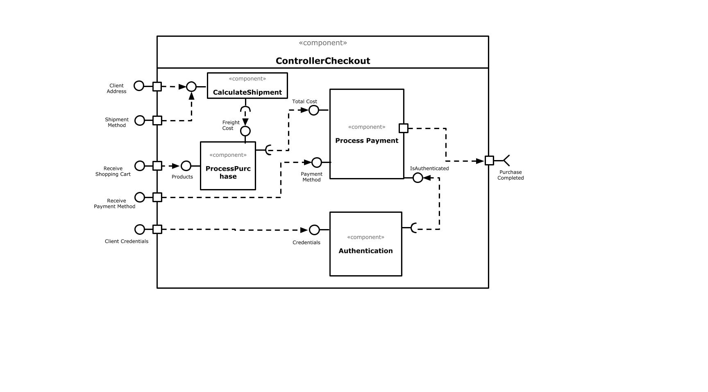

# Lab 5
Tarefas do laboratório 5 - Renato César Alves de Oliveira

## Tarefa 1

## Tarefa 2
Link para o projeto no Codepen: [React 03 - Dinossauro Codepen](https://codepen.io/renato2808/pen/KKzXeMB)

**HTML**
~~~html

~~~

**JavaScript**
~~~javascript
function Button(props) {
  return (
    <button className="button" onClick={props.onClick}>
      {props.value}
    </button>
  );
}

class Elemento extends React.Component {
  constructor(props) {
    super(props);
    this.state = {
      options: ["Pulou na lama", "Pulou no lago.", "Pulou no mar."],
      state: ""
    };
  }
  
  renderOption(i) {
    return <Button value={this.state.options[i]}
             onClick={() => this.handleClick(i)} />;
  }
  
  handleClick(i) {
    if (i == 0){
      this.setState({state: "Sujo"})
    }
    
    if (i == 1){
      this.setState({state: "Molhado"})
    }
    
    if (i == 2){
      this.setState({state: "Afogado"})
    }
  }
  
  render() {
    let status;
    status = this.state.state;
          return (
                 

                   <h2>O dinossauro :</h2>
                   {this.renderOption(0)}
                   {this.renderOption(1)}
                   {this.renderOption(2)}
                   

                        
                      
O dinossauro está: {status}

                   

                 

            );
  }
}

ReactDOM.render(<Elemento />, 
        document.getElementById("root"));
~~~